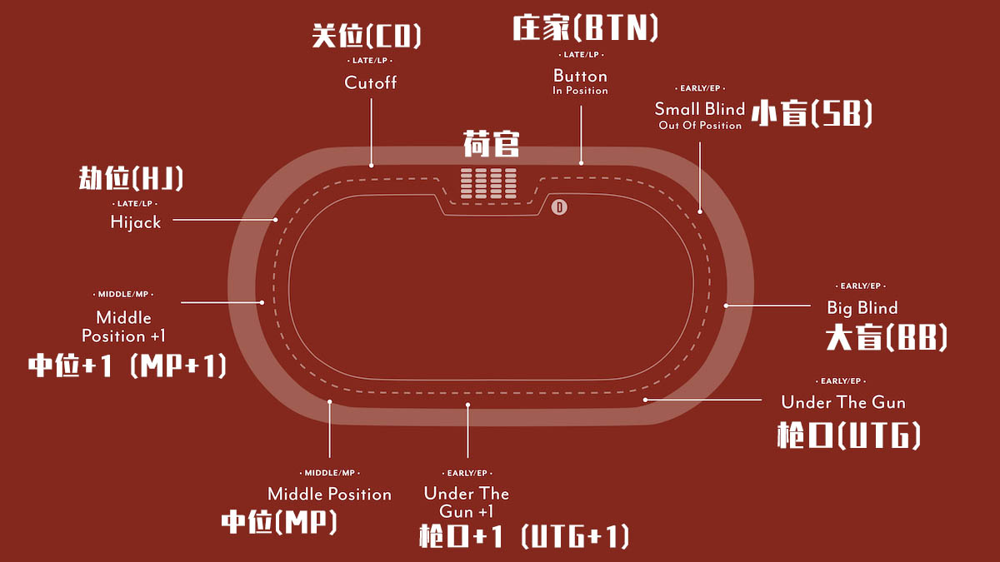
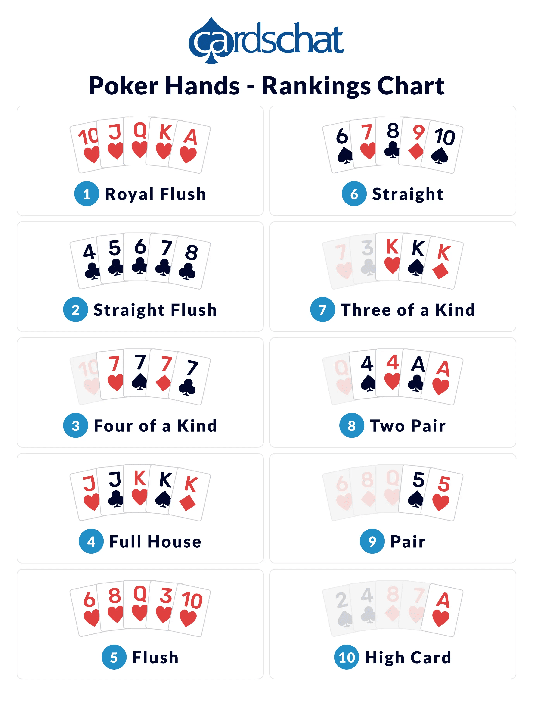

# 德州扑克规则与玩法 V1.1
## 座位图

## 荷官庄家位置的确定
第一个按钮庄家的位置是荷官（发牌的人）将牌一张一张地分发给玩家，拿到最强牌的人确定为庄家位。 确定按钮庄家位的玩家后，就开始正式发牌。
## 发牌
每个玩家发到2张排面朝下的牌，游戏开始。 这2张牌称为“底牌”或“口袋牌”。 游戏中只有2张牌是发给每位玩家的，除了进行摊牌外，没有必要将它展示给其他玩家，并且必须小心不要被人看到它。
## 翻牌前
先下大小盲注，然后给每个玩家发2张底牌，大盲注后面第一个玩家选择跟注、加注或者盖牌放弃，按照顺时针方向，其他玩家依次表态，大盲注玩家最后表态，如果玩家有加注情况，前面已经跟注的玩家需要再次表态甚至多次表态。
## 翻牌
同时发三张公牌，由小盲注开始（如果小盲注已盖牌，由后面最近的玩家开始，以此类推），按照顺时针方向依次表态，玩家可以选择下注、加注、或者盖牌放弃。
## 转牌&河牌
Turn—发第四张牌，由小盲注开始，按照顺时针方向依次表态。River—发第五张牌，由小盲注开始，按照顺时针方向依次表态，玩家可以选择下注、加注、或者盖牌放弃。
经过前面四轮发牌和下注，还剩余2名以上的玩家时，开始比大小，这时候需要亮牌。
## 亮牌
剩余2名以上的玩家开始亮牌比大小，成牌最大的玩家赢取池底。
亮牌是用自己的2张底牌和5张公共牌结合在一起，选出5张牌，通过比大小决定胜者。
不论手中的牌使用几张（甚至可以不用手中的底牌），凑成最大的成牌，跟其他玩家比大小。
## 牌型大小

## All-in
玩家全押只能赢取自己筹码量那部分筹码， 例如，玩家1在转牌下注$50，而玩家2仅剩$35， 如果玩家2跟注，则将玩家1下注的$50中拿出$35放入底池的”主池”(main pot)中，而剩余的$15将分两种情况:
(a)如果是玩家1与玩家2两个人单挑，则将$15返还给玩家1;
(b)将$15放入“边池”(side pot)，未弃牌且还有筹码的玩家将争夺边池中的筹码。全押后，玩家2无法从边池中赢得任何筹码。
如果两名玩家单挑，其中一名全押，另一名玩家跟注或全押，将省略之后的下注回合 ，直接发完5张牌然后摊牌比大小。现金局中，这种情况也可以提前摊牌，然后2名玩家协商发多次(run it twice)来降低波动；这种情况必须是2名玩家的全押，必须2人都同意发多次(一般2-5次)，从全押的时刻开始，把剩余的公共牌发出多次，按赢的次数比例分底池。